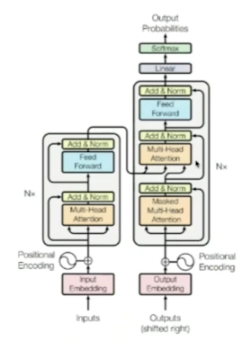
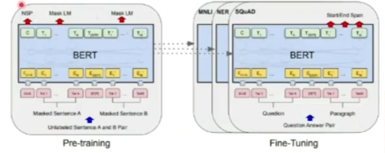
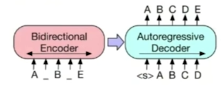
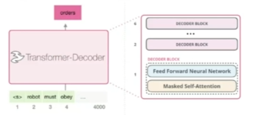
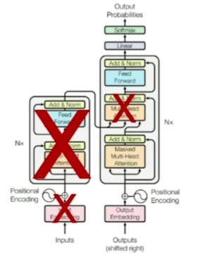
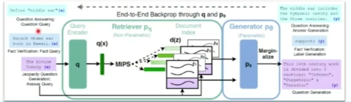

1. LLM(Large Language Models)
- Transformer(2017.06)
    - 내부에 인코더 파트와 디코더  파트가 존재하며 이 둘 사이를 이어주는 연결고리가 존재(오리지널 버전에서는 여섯개의 인코더와 여섯개의 디코더를 사용)
    

- BERT(Bidirectional Encoder Representations from Transformer)(2018.10)
    - Transformer의 인코더 구조만 사용
    - 번역 모델이 아닌 범용 모델이므로 대용량의 코퍼스를 사용하여 두 가지 과업을 학습
        - Masked language model(MLM): 가려진 것을 찾아가는 과정에서 문맥 파악
        - Next sentence prediction(NSP): 앞 뒤 문장이 연관이 있는지 파악
    

- BART(Bidirectional and Auto-Regressive Transformer)(2019.10)
    - 문장을 생성하는 모델
    - Original Transformer는 기계 번역을 위해 제안됨
        - Source-targer의 parired dataset을 통한 supervised learning 방식
    - BART 아이디어: Transformer 구조를 사용해서 self-supervised learning을 학습하는 방법
        - 입력 token을 단순 masking하는 것이 아니라 corruption 시켜서 사용하는 방법
    

- T5(Exploring the Limits of Transfer Learning with a Unified Text-to-Text Transformer)(2019.10)
    - 모든 언어 문제를 text-to-text format으로 변환하는 통합된 프레임워크 unified framework
    - 기본적인 구조는 Original Transformer의 구조를 그대로 따름
        - 차이점: Layer Normalization, Position Embedding

- GPT-1(Generative Pre-Training of a Language Model)(2018.06)
    - 비지도 학습 기반의 사전 학습
    - Transformer의 디코더(12 layers)만 사용한 언어모델
    - 사전 학습 objective: Language Modeling(Auto-Regressive)
        - 주어진 token sequence를 바탕으로 next token 예측
        
        

- GPT-2(2019.02)
    - 직접 구축한 대량의 데이터셋을 이요하여 더 많은 parameters로 구성된 모델을 설계
    - GPT-1과의 차이점: GPT-1의 구조를 확장시켜 더 많은 데이터를 이용해 잘 학습시킨 모델

- GPT-3(2020.05)
    - Few-Shot Learners(몇 개 안보고도 문제 해결)
    - 사전 학습된 언어 모델
        - 과업 의존적 구조를 사용하지 않고도 미세 조정이 가능
        - 미세 조정을 위해서는 여전히 해당 과업의 데이터셋이 필요
        - 실제 사람은 언어를 배울 때 모든 Superviese Task 데이터셋을 필요로 하지 않음
    - 메타 러닝(Meta-learning): 미세 조정용 데이터셋을 사용하지 않아도 되는 대안
        - In-context learning: 학습 과정에서 다양한 형태의 문제를 풀어낼 수 있는 역량을 기르도록 설계
        - 모델이 task에 대한 정보를 참고해서 inference할 수 있도록 input에 예제(demonstrations) 추가
    - 문제점
        - 사실을 지어내거나, 편향적이거나, 유해한 텍스트를 생성하거나, 사용자 지시를 따르지 않는 경우 발생(ex. 이루다)
        - Alignment: 인간의 의도에 맞게 동작하도록 LM을 조정하는 것

- InstructGPT(2022.03)
    - Reinforcement Learning with Human Feedback, RLHF
    - 인간의 피드백을 통한 강화학습으로 광범위한 지시사항을 따를 수 있도록 GPT-3을 fine-tuning
    - 인간의 평가(선호도)를 Reward로 사용

- ChatGPT(2022.11)
    - GPT-3.6(or InstructGPT)의 fine-tuned version
    - Safety가 강조된 버전

- GPT-4(2023.03)
    - 텍스트 뿐만 아니라 이미지도 인식할 수 있는 멀티모달 버전
    - GPT-3.5버전에 비해 크게 확장된 규모와 개선된 성능을 통해 다양한 테스트에서 훨씬 더 우수한 점수 획득

- RAG(Retrieval-Augmented Generation)
    - Retrieval에서 사용자 쿼리가 들어왔을 때 기존 가지고 있는 데이터베이스에서 유사한 것을 찾아 Generator의 input으로 같이 사용. Generator에서 답변 생성
    - 교과서가 옆에 있으므로 보다 정확한 답변 가능
    - Query Encoder: Dense Passage Retriever(DPR) Query Encoder 이용
    - Passage Encoder: DPR Passage Encoder 이용
    - Generator: BART Large
        - Query가 입 력되면 Query Encoder를 통과하여 representation(q(x)) 생성
        - q(x)와 가장 가까운(Inner Product 기준) {5, 10}개의 Passage 탐색
        - Passage를 기존 Query와 concat하여 Generator Input으로 사용하고 각 Passage별 생성 결과를 Marginalize하여 최종 결과물 도출
    

2. LLM 현업 적용 사례
- 낚시성 기사 탐지
    - 제목, 부제목, 본문, 이미지 캡션을 활용하여 제목과 본문의 불일치 문서 탐지(부제목이 큰 영향)
    - Attention 기반의 모델(Attention-based Hierarchical Model)
    - 뉴스 부제목 생성 모델: 부제목이 없는 기사도 있으므로
- 금융 문석 감성 분석
    - 미국의 8-k 공시문서 기반의 감성 분석 기반의 주식 가격 움직임 예측
- AutoESG: RAG를 활용해 기업의 지속가능 경영 정보를 파악

3. QNA
- 현업에서 LLM을 활용할 때 오픈소스 모델과 상용 모델 중 어떤 기준으로 선택하는지?
    - 내부정보를 활용하면 상용 모댈을 자체적으로 튜닝해 사용, 보안 이슈가 있기 때문
    - Small Languege Model에 RAG 기술을 활용하는 식
- 프로젝트를 진행할 때 데이터 탐색 필수
    - 단순히 데이터를 가져와서 모델링하는 것은 그리 중요하지 않다
    - 불균형 문제 해결 전후, 결측치 처리 전후 데이터와 그 결과가 어땠는지 등 데이터를 계속 뜯어보면서 모델링을 다양하고 깊게 적용해보는 것이 더 중요하다, 그 과정을 보여주는 것이 중요하다