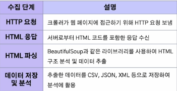
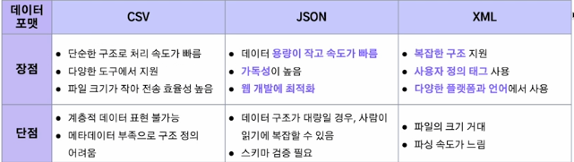

1. 크롤링을 통한 데이터 수집
- 웹 크롤링
    - 정의
        - 자동화된 스크립트(봇)을 이용해 웹 페이지를 자동으로 탐색하고 데이터를 수집하고 저장하는 과정
        - 주로 검색 엔진에서 웹 페이지를 수집하여 색인(Indexing)하거나, 데이터 분석 및 연구를 위해 대량의 데이터를 수집
    - 원리
        - 크롤러가 특정 웹 페이지에 접근하여 HTML코드를 다운로드한 후, 필요한 정보를 자동 추출
        - 크롤러는 웹 페이지의 링크를 따라가며 연속적으로 페이지를 탐색하여 데이터 수집
        - 수집한 데이터를 정제 및 가공하여 분석 가능한 형태로 저장
        
    - 관련 용어
        - 웹 스크래핑(Web Scraping): 크롤링과 유사하지만, 주로 특정한 정보(가격정보, 리뷰 둥)을 추출하여 가공하는데 중점
        - 데이터 랭글링(Data Wrangling): 수집된 원자료(Raw Data)를 변환 및 매핑하는 과정
        - 파싱(Parsing): HTML, XML 등의 문법적 구조를 해석하여 필요한 데이터를 추출
        - 인덱싱(Indexing): 검색 속도를 높이기 위해 데이터베이스에 색인을 생성하는 작업
        - 슬라이싱(Slicing): 리스트와 같은 순회 가능한 객체의 특정 부분을 잘라내는 작업
    - 웹 크롤링 순서
        1. Robots.txt 기준을 확인하여 크롤링 가능한 웹사이트인지 확인
            - Robots.txt
                - 웹 사이트에서 크롤러의 접근을 제어하기 위해 사용하는 텍스트 파일
                - 웹 사이트 소유자가 크롤러가 접근 가능한 영역과 제한해야 할 영역을 정의
                - 권고 사항이며, 강제성은 없음
                - 용어
                    - User-agent: 특정 크롤러를 지정하거나, *을 사용하여 모든 크롤러에 적용
                    - Disallow: 크롤러를 차단할 경로 설정
                    - Allow: 특정 경로는 크롤링을 허용
                    - Sitemap: 크롤러에게 사이트맵 위치를 알려줌으로써 더 효율적으로 크롤링을 수행하도록 안내
        2. Urllib나 Request 라이브러리로 해당 사이트를 불러와서 BeautifulSoup으로 HTML 문서를 파싱
        3. HTML의 구조를 파악하여 find문이나 select문을 이용해 추출하고자 하는 부분을 찾아 텍스트 문서로 추출
        4. 정규표현식(re)이나 KoNLPy 라이브러리를 이용해 텍스트를 정제하여 필요한 정보를 정리
    - 고려사항
        1. 윤리적 문제
            - 대량의 요청을 보내면 웹 서버에 과부하를 유발할 수 있어 서비스 장애 유발. 크롤링 시 적절한 요청 간격을 두어야 함
            - 사용자의 동의 없이 개인 정보를 수집한 경우 법적 처벌 가능
        2. 법적 문제
            - 일부 웹사이트는 이용 약관에 따라 크롤링을 금지하며, 이를 무시하고 데이터를 수집하면 법적 분쟁 발생 가능
            - 웹 페이지의 컨텐츠를 무단으로 수집하여 상업적 목적으로 사용하는 경우 저작권법 위반에 해당(ex. 여기어때 플랫폼에서 야놀자 플랫폼에 게시된 숙박업소 정보를 대량 수집해 발생한 법적 문제)
    - 크롤링 라이브러리
        - Requests: 정적 수집도구. 단순한 형태의 문법, 인코딩 확인, 헤더 파악, 텍스트 전환이 용이하고, 딕셔너리 형태로 데이터 전송
        - Urllib: 정적 수집도구. 데이터를 바이너리 형태로 인코딩하여 데이터 전송
        - Selenium: 동적 수집도구. 웹 브라우저 드라이버 설치 필요, 동적인 여러가지 상호작용으로 데이터 수집
            - 웹 애플리케이션의 테스트를 자동화할 수 있도록 설계된 오픈 소스 프레임워크
            - 웹사이트가 자바스크립트로 동적 콘텐츠를 로드하는 경우, 브라우저를 직접 제어하여 동적 페이지의 콘텐츠도 스크래핑 가능
        - BeautifulSoup: 본문 파싱을 위한 도구. HTML 문법으로 작성된 문서를 파싱하여 필요한 부분의 태그를 기준으로 데이터 추출 및 정제
            - HTML 문서를 단순한 파이썬 객체처럼 다룰 수 있어 직관적이고 사용이 간편
            - CSS 선택자, 태그, 속성 등 다양한 방식으로 데이터 선택 가능
        
    - 데이터 포맷
        1. CSV
            - 데이터를 쉼표(,)로 구분하여 저장한 텍스트 파일 형식
            - 각 줄은 레코드(record), 쉼표로 구분된 값들은 필드(field)
            - 저장 공간을 적게 사용하고 처리 속도가 빠름
        2. JSON
            - JavaScript에서 파생된 경량 데이터 교환 형식
            - 사람이 읽기 쉽고 기계가 분석 및 생성하기 쉬운 구조
            - Key-Value 쌍으로 이루어진 데이터 구조
        3. XML
            - 데이터의 구조와 의미를 설명하기 위해 태그를 사용하는 언어
            - 사용자 정의 태그를 사용하여 데이터를 표현
            - 계층적 구조와 속성을 사용하여 다양한 데이터 형태를 표현 가능
        

2. API를 통한 데이터 수집
- Open API(Application Programming Interface)
    - 정의
        - 웹 사이트에서 서비스를 제공하는 구체가 자신이 가진 기능을 이용할 수 있도록 공개한 프로그래밍 인터페이스
    
    
- 공공데이터 API
    - 공공데이터 포털: 다양한 정부기관과 공공기관에서 보유한 데이터를 누구나 접근할 수 있도록 공개