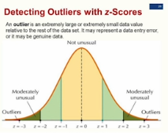
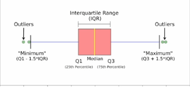
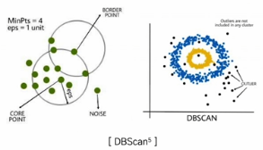
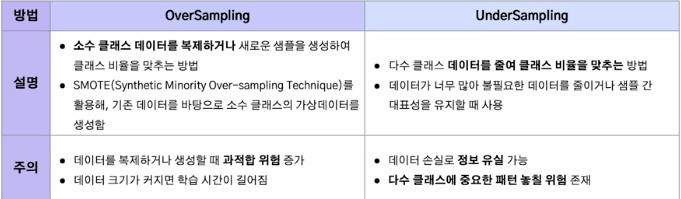
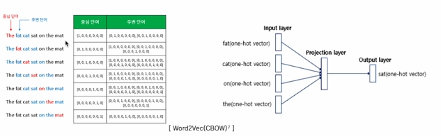
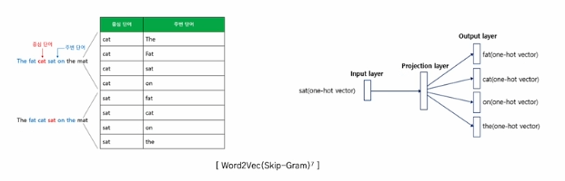
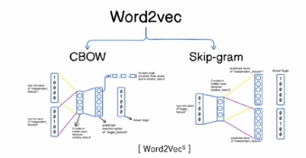

1. 데이터 품질 문제 유형
- 결측치(Missing Value): 수집된 데이터셋 중 관측되지 않거나 누락된 데이터
    - 값의 특성: Null
    
- 이상치(Outlier): 관측된 데이터의 범위에서 많이 벗어난 아주 작은 값이나 큰 값
    - 탐지 방법
        1. Z-Score
            - 데이터의 분포가 정규 분포를 이룰 때, 데이터의 표준 편차를 이용해 이상치를 탐지하는 방법
            - 해당 데이터가 평균으로부터 얼마나 표준편차만큼 벗어나 있는지를 의미
            - 주로 Z-Score에서 3보다 크고 -3보다 작은 값을 이상치로 판별
            
        2. IQR(Interquartile Range) with Box plots
            - 데이터의 분포가 정규 분포를 이루지 않거나 한쪽으로 치우친 경우, 데이터의 IQR 값을 사용해 이상치를 탐지
            
        3. Isolation Forest
            - 결정트리 계열의 비지도 학습 알고리즘으로 고차원 데이터셋에서 이상치 탐지할 때 효과적
            - 이상치는 정상 데이터보다 고립되기 쉽다는 점을 활용
            
        4. DBScan(Density Based Spatial Clustering of Applications with Noise)
            - 밀도 기반 클러스터링 알고리즘으로, 밀도 기준으로 군집을 정의하고 밀도가 낮은 데이터를 이상치로 탐지
            - 밀집된 지역에서 데이터를 군집화한 후, 밀도가 낮아 어느 군집에도 속하지 못하는 점들을 이상치로 간주
            

- 불균형 데이터(Imbalanced Data)
    - 정의: 범주형 데이터 중, 클래스 간 샘플 수의 비율이 크게 차이 나는 데이터
    - 예시: 이진 분류에서 긍정 클래스가 10%이고, 부정 클래스가 90%인 경우
    - 문제점: 다수의 쿨래스에 맞춰 예측하는 경향이 생김, 정확도가 높더라도 소수 클래스 예측 성능은 낮을 수 있음
    - 데이터 접근 해결 방법
    
    - 알고리즘 접근 해결 방법
    

- 데이터 스케일링
    - 데이터의 크기, 단위, 분포 차이를 조정하여 머신러닝 모델의 성능을 향상시키기 위한 과정
    - 많은 알고리즘은 변수의 크기에 영향을 받기 때문에 값이 큰 데이터가 더 큰 영향을 미치지 않도록 조정 필요
    - 단위나 범위가 크게 다른 경우, 특정 특징이 다른 특징을 압도하는 문제를 방지
    - 방법
        - Standard Scaler: 표준화 방식, 데이터의 평균을 0, 표준편차를 1로 조정
        - Min-Max Scaler: 정규화 방식, 데이터 값의 0과 1 사이의 값으로 스케일링
        - Log 변환: 데이터의 분포가 심하게 왜곡된 경우 로그 적용, 음수나 0 값은 변환 불가

2. 자연어 데이터의 고유 문제
    - 비정형 데이터: 틀이 잡혀있지 않고 사전 정의가 없는 데이터
    - 희소성: 높은 차원에 비해 특정 단어가 드물게 나타나, 문장 간 유사도를 파악하기 어려움
    - 모호성과 중의성: 단어의 다의성과 문맥 의존성
    - 다양성: 동일한 의미를 가진 다양한 표현
    - 비표준 표현: 대/소문자, 띄어쓰기, 맞춤법, 오탈자, 문법 오류
    - 불필요한 단어: 길이가 짧은 단어, 등장빈도가 적은 단어, 특수기호
    - 비구조화: 컴퓨터가 자연어 데이터를 인식 및 처리할 수 없음
    
    - 해결 방법
        1. 텍스트 정제(Text Cleaning)
            - 텍스트 데이터에서 의미가 없는 기호, 숫자, 불용어 등을 제거
                - 불용어: the, is, 것 같이 의미가 없는 단어
            - 예시: URL, HTML 태그 제거
        2. 텍스트 정규화(Text Normalization)
            - 데이터를 일관된 형식으로 변환하여 모델이 학습하기 쉽도록 만듦
            - 문법적, 의미적 표준 형태로 통일
            - 예시: 소문자 변환, 철자 교정
        3. 토큰화(Tokenization)
            - 텍스트를 단어, 문장, 서브워드 등으로 분리하여 분석 가능한 형태로 만듦
            - 토큰은 텍스트 분석에서 다룰 수 있는 최소 단위로, 이를 통해 텍스트를 구조화하여 모델이 이해할 수 있게 함
            - 라이브러리: transformers, konlpy(한국어 적용) 사용하여 토큰화 진행
        4. 텍스트 벡터화(Text Vectorization)
            - 자연어 데이터를 수치화하여 컴퓨터가 처리할 수 있는 형태로 변환
            
            - TF-IDF(Term Frequency-Inverse Document Fewquency)
                - 단어의 빈도(TF)와 역문서 빈도(IDF)를 조합하여 단어의 중요도 정도를 가중치로 주는 방법
                - 문서 내에서 특정 단어가 많이 등장하면서도, 전체 
                문서에는 드물게 등장하는 단어에 높은 점수 부여
            - Word2Vec
                - 단어를 고차원 벡터로 매핑하는 임베딩 방법으로, 단어의 문맥적 관계 학습
                - CBOW(Continuous Bag of Words)와 Skip-Gram 두가지 모델 구조를 사용하여 효율적 학습이 가능
                    - CBOW: 주변에 있는 단어들을 입력으로 중간에 있는 단어들을 예측하여, 중심 단어가 희귀 단어일 때 유리
                    
                    - Skip-Gram: 중심 단어에서 주변 단어를 예측하여 주변단어가 희귀 단어일 때 유리
                    
                - 의미적 유사성 반영(ex. king - man + woman = queen)
                - 단어간 수학적 연산 가능
                

3. 윤리 및 법적 문제
- 개인정보 및 민감정보가 유출되거나 악용될 위험이 있음
- 데이터 편향 및 차별: 데이터셋이 편향된 내용을 포함. 편향된 데이터를 학습한 모델이 특정 그룹에 대해 차별적 결정을 내릴 위험성
- 데이터의 왜곡 및 조작
- 저작권 및 데이터 소유권: 옵트아웃(당사자가 자신의 데이터 수집을 허용하지 않는다고 명시할 때 정보 수집이 금지되는 제도)
- 허위정보 유포 및 범죄 악용