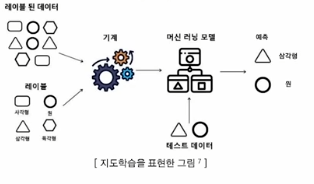
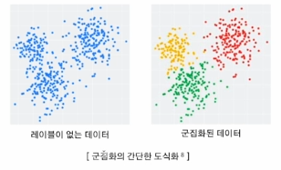
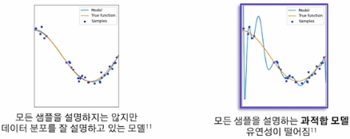
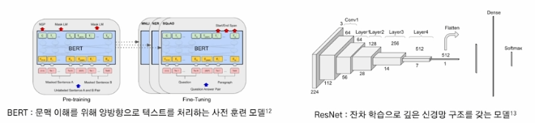

1. 데이터와 AI 모델
- AI = Code + Data
    - AI 시스템은 코드(모델 및 알고리즘)와 데이터로 구성(서비스 출시 전 5(데이터):5(모델링), 출시 후 8:2)

- 형식에 따른 데이터의 종류
    1. 정형 데이터
        - 정의: 고정된 형식과 구조를 갖는 데이터
        - 예시: 엑셀, MySQL, 관계형 DB 등
        - 활용 예시: 거래 금액, 시간 등으로 사기 거래 탐지, 환자의 나이, 혈합, 혈당 등으로 환자 진단 질병 예측
    2. 반정형 데이터
        - 정의: 고정된 형태는 없으나 특정한 구조를 갖춘 데이터
        - 예시: JSON, XML, HTML 등
        - 활용 예시: 로그 데이터 이상 탐지(서버 로그에서 이상 트래픽 탐지), JSON 데이터의 텍스트 기반 정보를 추출하여 요약 작업 수행
    3. 비정형 데이터
        - 정의: 특정한 구조가 없는 데이터
        - 예시: 텍스트, 이미지, 비디오 등
        - 활용 예시: 자율주행 차량의 차선 및 보행자 인식, 의료 분야에서 CT, MRI 데이터 분석

- 모델 훈련에 따른 데이터의 종류
    1. 지도학습(Supervised Learning)
        - 입력 데이터와 이에 대응하는 정답 레이블이 제공되는 데이터셋을 사용하여 모델 학습
        - 새로운 데이터가 주어졌을 때 정답을 예측할 수 있도록 함
        - 대표 알고리즘
            - 분류(Classification): 데이터가 특정 범주에 속하는지 예측
            - 회귀(Regression): 데이터의 연속적인 값을 예측
            
    2. 비지도학습(Unsupervised Learning)
        - 정답 레이블이 없는 데이터셋을 사용하여 데이터의 패턴이나 구조 학습
        - 주로 데이터의 분포, 군집, 특징을 탐색
        - 대표 알고리즘
            - 군집화(Clustering): 데이터를 유사한 그룹으로 나눔
            
            - 차원 축소(Dimensionality Reduction): 데이터의 차원을 줄이면서 특성 유지

- 데이터 크기의 중요성
    - 다양성 확보: 다양한 학습 케이스를 포함할 가능성이 높아 일반화 능력 향상
    - 노이즈 감소: 학습 데이터의 양이 많아 노이즈의 영향이 줄어들어 희석되는 효과
    - 과적합 방지: 특정 패턴에 과도하게 의존하는 것을 방지
    - 복잡한 패턴 학습: 다양한 학습을 하며 복잡한 모델을 학습
    - 희귀 케이스 포착: 데이터의 양이 많을 수록 드문 케이스도 포함할 확률 증가

- 데이터의 크기가 부족할 때 생기는 문제
    - 과적합(Overfitting)
        - 정의: 모델이 훈련 데이터의 특징들을 과도하게 반영하여 새로운 데이터에 대한 일반화 성능이 떨어지는 현상
        - 원인: 데이터가 부족하여 훈련 데이터 내 포함된 노이즈 데이터를 정상적인 패턴으로 인식하고 학습
        

- 데이터의 품질
    - 데이터의 크기도 중요하지만, 품질이 낮은 채 크기만 크다면 좋은 데이터라 할 수 없음
        - 품질이 좋으면 결측치, 이상치, 중복값 등의 노이즈 데이터가 적어 데이터의 양이 다소 부족하더라도 모델을 복잡하게 설계하지 않고 효율적으로 학습하게 할 수 있음
        - 품질이 나쁘면 노이즈 데이터의 양이 많아 정상적인 모델 학습에 방해가 될 수 있음, 품질을 올리기 위한 추가적인 전처리 작업에 많은 시간 및 비용 소모
    - 데이터의 유형별로 품질을 평가할 수 있는 여러 기준을 세우고 이에 따라 관리하는 것이 중요
    - 데이터 유형 별 품질 기준
        1. 정형 데이터
            - 완전성: 누락된 데이터 값이 없어야 함
            - 유일성: 중복된 값이 없어야 함
        2. 비정형 데이터
            1. 이미지
                - 해상도: 이미지의 픽셀 단위
                - 정확성: 이미지의 정보와 메타데이터의 일치
            2. 동영상
                - 운용성: 사운드 및 자막 동기화 여부
                - 이해성: 영상 끊김의 정도

2. Model-Centric AI, Data-Centric AI
- Model-Centric AI
    - 정의: AI 시스템 개발에서 모델을 중심으로 접근하는 방법론
    - 데이터를 일정 수준 고정 혹은 제한하고 모델 자체의 설계와 최적화에 집중
    - 과거부터 지금까지 주로 사용되는 AI 시스템 개발의 주 접근 방식
    - BERT, GPT, ResNet 등
    
    - 주요 목적
        - 모델 설계: 다양한 딥러닝 모델(CNN, RNN, Transformer 등)의 구조를 연구하고 새로운 아키텍처 개발, 모델이 주어진 문제를 해결할 수 있도록 설계
        - Hyperparameter 최적화: 학습 속도, Batch Size, Dropout 비율 등을 조절하여 성능 향상을 이끌어냄
        - 모델 훈련 알고리즘 개선: SGD, Adam 등의 최적화 알고리즘 개선 및 새로운 방법론 적용
        - 성능 평가 및 튜닝: 모델 성능 테스트 후 과적합 및 과소적합 방지를 위한 모델 수정
    - 한계
        - 정교한 모델이라 하더라도 데이터의 품질이 떨어지면 결국 좋은 성능이 나오기 어려움
        - 투입한 시간과 노력에 비해 모델의 성능이 극적으로 향상되는 경우는 드묾
        - 사례
            - Steel 제조업에서 개발한 불량품 탐지 AI 시스템: 초기 탐지 정확도는 76.2%였으나 Model-Centric AI 접근법으로는 목표 정확도인 90%에 도달할 수 없었음
    - 다른 방법론의 필요성
        - 과거 연구의 트렌드: Task에 맞는 데이터를 대량으로 집어 넣고 노이즈를 잘 걸러내는 모델을 만드는 것
        - 최근 연구의 트렌드: 사전 학습 모델에 소량의 고품질 데이터를 확보하여 Fine-Tuning하는 것
        - AI 시스템에서 데이터가 차지하는 비율이 80%
- Data-Centric AI
    - AI 시스템 개발에서 데이터를 중심으로 접근하는 방법론
    - 데이터가 AI 성능의 핵심이라는 인식에서 출발
    - 모델의 구조를 고정 혹은 최소한의 조정 후 데이터 품질에 노력을 기울임
    - 2020년대 들어 주목받기 시작한 접근 방식
    - 필요성
        - 모델 성능을 종합적으로 평가할 수 있는 데이터셋이 필요
        - 실전에서는 소량의 데이터가 반복적으로 생성되므로 좋은 데이터셋을 생성해내는 알고리즘이 필요
    - 목표
        1. Training Data Development: 훈련 데이터는 모델 학습의 기초로, 고품질의 데이터를 구성하는 것이 중요
            - Data Collection: 새로운 데이터 구축 또는 기존 데이터셋 통합
            - Data Labeling: 수집한 데이터들에 라벨을 부여하여 학습 가능한 형태로 만듦
            - Data Preparation: 데이터 정제, 특징 추출, 표준화 및 정규화를 통해 학습 준비
            - Data Reduction: 특징 선택, 차원 축소 등을 통해 데이터의 크기와 복잡성 감소
            - Data Augmentation: 데이터를 더 수집하지 않고 다양성을 높임
        2. Inference Data Development: 추론 데이터는 모델의 성능 평가를 위한 테스트와 검증 데이터로 사용됨
            - In Distribution Evaluation: training 데이터와 같은 분포를 가진 데이터셋으로 모델 성능 평가
            - Out of Distribution Evaluation: 다른 분포를 가진 데이터셋으로 성능 평가
        3. Data Maintenance: AI 시스템 운영 환경에서는 데이터가 지속적으로 변화하며, 데이터 유지 관리가 필수
            - Data Understanding: 데이터의 특성을 전반적으로 이해할 수 있는 알고리즘
            - Data Quality Assurance: 데이터의 퀄리티를 평가할 수 있는 Metric을 개발
            - Data Storage & Retrieval: 데이터를 효율적으로 저장하고 빠르게 검색할 수 있도록 관리
- Model-Centric AI와 Data-Centric AI는 상호 보완적
    - AI 시스템 개발에서 데이터와 모델 모두 최적화하는 것이 중요함
    