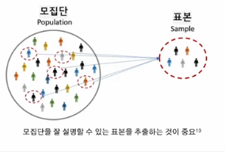
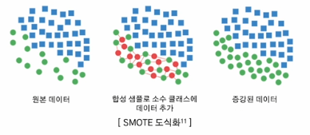
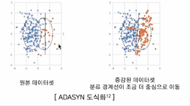
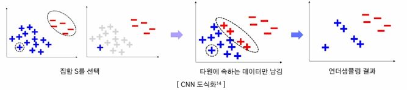
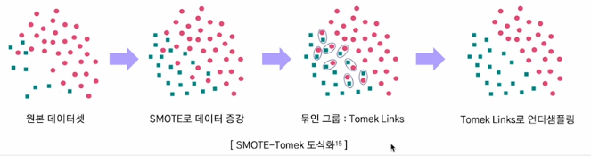
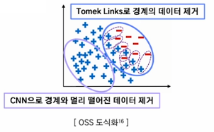

1. 데이터 편향의 이해와 유형
- AI의 편향은 학습되는 데이터로부터 발생할 가능성이 큼
- 유형
    1. 표본 편향(Sample Bias): 데이터가 전체 모집단을 적절히 대표하지 못하는 경우 발생, 선택 편향(Selection Bias)으로도 불림
        - 원인
            - 데이터 수집 과정에서 특정 그룹을 과대 또는 과소 대표
            - 표본의 크기가 충분히 크지 않거나 무작위성을 확보하지 못함
        - 사례
            - 2차 세계 대전 당시 미군 전투기의 탄흔 숫자 분석
    2. 측정 편향(Measurement Bias)
        - 원인
            - 데이터 측정 도구의 부정확성
            - 데이터를 라벨링하는 과정에서 발생하는 실수
        - 사례
            - 스마트폰 센서로 걸음 수를 측정할 때 기기 문제로 과소 측정
            - 법적 판결 데이터 학습 시 판사의 편 견이 반영된 레이블
    3. 사회적 편향(Social Bias): 데이터에 사 회적 고정관념, 차별, 불평등이 반영
        - 원인
            - 이미 사회에 많이 녹아들어 있는 편향
            - 데이터 수집 과정에서 특정 집단의 특성이 과잉 반영
        - 사례
            - 번역 모델이 Doctor를 남성으로 지칭하고 Nurse를 여성으로 지칭
            - 특정 인종에 대한 의료 정확도가 낮음
    4. 확증 편향(Confirmation Bias): 기존 가설을 강화하거나 뒷받침하는 데이터만 선택적으로 사용
        - 원인
            - 연구자나 데이터 과학자가 원하는 결과를 지지하는 데이터만 사용
            - 반대되는 데이터를 무시하거나 배제
        - 사례
            - 특정 약물이 효과적이라는 실험 결과만 선택
            - 긍정적인 리뷰만 수집
    5. 데이터 불균형(Imbalance Bias): 특정 클래스가 다른 클래스에 비해 과대 또는 과소 대표하여 균형이 맞지 않음
        - 원인
            - 데이터의 자연적 분포가 불균형
            - 수집 과정에서 특정 클래스가 배제됨
        - 사례
            - 희귀한 질병 데이터가 적어 모델이 해달 질병을 제대로 탐지하지 못함
    6. 알고리즘 편향(Algorithmic Bias): 데이터 편향 뿐만 아니라 알고리즘의 설계, 모델 학습 과정에서 발생하는 편향
        - 원인
            - 알고리즘이 최적화하려는 목적 함수가 공정성을 고려하지 않고 설계된 경우
            - 출력 결과가 다시 데이터로 피드백이 되며 편향이 강화됨
        - 사례
            - 고객 대출 승인 모델이 대출 승인률 최대화를 목표로 설계된 경우, 소득이 낮은 그룹은 과소평가
            - 추천 시스템이 인기 콘텐츠만 반복적으로 추천하여 다양성 감소 
    
- 데이터 편향이 모델에 미치는 영향
    1. 일반화 능력 부족
        - 특정 그룹에 대해 과적합된 결과를 냄
        - 실제 배포 환경 및 새로운 데이터에 대해서는 낮은 성능
    2. 공정성 문제
        - 모델이 특정 그룹에 유리하거나 불리한 결과를 초래하여 윤리적 문제를 발생

- Bias(편향)
    - 모델이 학습 데이터로부터 얻은 추청값이 실제 정답(목표값)과 얼마나 다른지를 나타냄
    - 모델이 학습 데이터의 패턴을 제대로 학습하지 못해 발생하는 오류
    - 편향이 높은 모델은 데이터 내에 패턴을 통해 제대로 예측하지 못하기에 보통 일관되게 정답을 벗어남

- Variance(분산)
    - 모델이 학습 데이터의 작은 변동에 얼마나 민감하게 반응하는지를 나타냄
    - 학습 데이터의 세부적인 패턴을 과도하게 학습(overfitting)하여 새로운 데이터에서 일반화가 어렵게 되는 경우 발생

- Bias-Variance Trade-off
    - 머신러닝 모델에서 과소적합(Underfitting)과 과적합(Overfitting) 사이의 균형을 설명하는 개념
    - 목표: Bias와 Variance를 적절히 조정하여 최적의 일반화 성능을 얻는 것
    
    - 간단한 모델은 패턴을 제대로 학습하지 못해서 Bias가 높고, 예측치의 가변성이 작으므로 Variance가 낮음
    - 복잡한 모델은 패턴을 잘 해석하기에 Bias은 낮아 내재된 패턴을 더 잘 포착할 수 있으며, 훈련 데이터에 너무 잘 맞기에 예측치의 가변성이 높아서 Variance이 높음
    - 따라서 Bias와 Variance가 균형을 이루는 지점을 찾아야 함
    

2. 데이터 편향 완화 전략
    - 데이터 수집 단계
        - 대표성 있는 데이터 수집: 일반화 능력 향상, 공정성 확보
            - 데이터 수집 범위 확장
            - 무작위 샘플링: 모집단의 다양한 특성을 공정하에 반영하는 데이터 확보
            - 층화 샘플링: 모집단의 중요한 특성으로 나누고 각 그룹에서 균등하게 데이터 수집
            - 데이터 증강: 현실적인 수집이 어려운 데이터의 경우
        
        - 데이터 수집 기준 표준화: 불일치와 편차 최소화
            - 표준화를 통해 일관된 기준으로 수집된 데이터로 정확성 향상
            - 동일 조건에서 수집한 데이터는 이후 실험과 분석의 재현성이 높아짐
            - 수집 도구 표준화, 수집 프로세스 표준화(문서화), 데이터 포맷 표준화
    - 데이터 균형화: 데이터셋 내 클래스 간 불균형을 완화하여 편향되지 않도록 조정
        
        - 오버 샘플링: 소수 클래스의 데이터를 늘림
            - 방법: SMOTE, ADASYN 등
            - 단점: 노이즈가 증폭될 가능성
            - SMOTE(Synthetic Minority Oversampling Technique)
                - 소수 클래스틔 데이터를 기반으로 새로운 데이터를 합성
                - 이웃 데이터 포인트 사이에 임이의 값을 생성
                
            - ADASYN(Adaptive Synthetic Sampling Approach)
                - 소수 클래스 데이터를 확대하되, 데이터 분포의 복잡성을 고려하여 생성
                - 학습하기 어려운 샘플(소수 클래스 데이터 주변에 다수 클래스 데이터가 많은 경우)에 더 많은 데이터 생성
                
            - 
        - 언더 샘플링: 다수 클래스의 데이터를 줄임
            - 방법: Tomek Links, CNN 등
            - 단점: 정보 손실 가능성
            - Tomek Links
                - 가장 가까운 두 데이터를 묶었을 때 각 데이터가 서로 다른 클래스에 속하는 것을 의미
                - 이런 모호한 데이터들을 찾아 제거하여 데이터의 경계를 명확히 하고 모델이 경계에서 더 정확히 학습할 수 있도록 도움
                
            - CNN(Condensed Nearest Neighbor)
                - 다수 클래스에서 데이터 하나를 뽑고, 소수 클래스 전체를 합집합한 것을 S 집합이라 둠
                - 다수 클래스 데이터 중 하나를 뽑아 소수 클래스와 더 가까우면 해당 데이터를 S에 포함시킴
                - 더 이상 선택되는 데이터가 없을 때까지 이를 반복(1-NN으로 분류되지 않는 데이터만 남기는 것)
                
        - 복합 샘플링
            - SMOTE-Tomek
                - SMOTE로 오버샘플링 수행하여 데이터를 증강
                - 증강된 데이터에서 경계에 위치한 Tomek-Links를 찾아 제거
                
            - OSS(One Sided Selection)
                - Tomek Links로 데이터셋의 경계를 확실히 만듦
                - 이후 CNN을 적용하여 경계와 멀리 떨어진 데이터를 제거
                
    - 모델 학습 단계
        1. 공정성 제약(Fairness Constraints)
            - AI 모델 학습 과정에서 공정성을 목표로 하는 제약조건을 추가하여 편향되지 않도록 조정
            - 편향된 데이터가 입력되어도 어느 정도 보정 가능
            - 방법
                1. 목적 함수에 공정성 제약 추가
                2. 민감 특성(성별, 인종 등)과 예측 간 상관관계 최소화
        2. 적대적 학습(Adversarial Debiasing)
            - 절차
                1. 생성자(에측 모델)는 민감 특성을 포함하지 않고 목표를 예측하도록 학습
                2. 판별자는 생성자의 예측 결과에서 민감 특성을 복원하려고 시도
                3. 생성자는 판별자가 민감 특성을 예측하지 못하도록 학습
    - 모델 평가 단계
        1. 모델에 공정성 평가 지표 사용
        2. 데이터 분포 모니터링