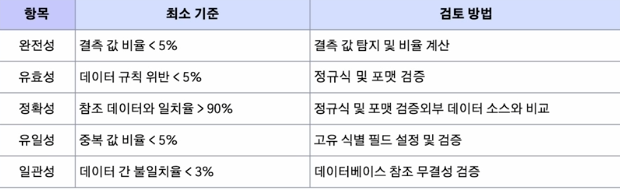
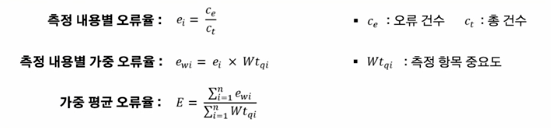

1. 데이터의 품질
- AI 모델이 학습하기에 얼마나 완전하고 정확하게 구축되었는가?
- 품질 기준
    - 완전성(Completeness): 필수 항목에 누락이 없어야 함
        - 개별 완전성: 필수 컬럼에는 누락 값이 없어야 함
            - 예시: 고객의 아이디는 NULL일 수 없음
        - 조건 완전성: 조건에 따라 컬럼 값이 항상 존재해야 함
            - 예시: 기업 고객의 등록 번호가 NULL일 수 없음
        - 위반된 경우: AI모델이 학습할 수 있는 정보가 줄어들고 중요한 정보가 손실될 수 있음
    - 유일성(Uniqueness): 데이터 항목은 유일해야 하며, 중복되어서는 안 됨
        - 단독 유일성: 컬럼은 유일한 값을 가져야 함
            - 예시: 고객의 이메일 주소는 유일하게 존재
        - 조건 유일성: 조건에 따른 컬럼 값은 유일함
            - 예시: 강의 시작일에 강의실 코드, 강사 코드가 모두 동일한 값은 유일하게 존재함
        - 위반된 경우: 중복된 특정 패턴을 과대평가하여 불균형한 모델이 만들어짐, 불필요한 학습 시간과 연산 자원 추가로 인한 낭비
    - 유효성(Validity): 데이터 항목은 정해진 데이터 유효 범위 및 도메인을 충족해야 함
        - 범위 유효성: 값이 주어진 범위 내 존재해야 함
            - 예시: 수능 시험의 점수는 0 이상 100 이하의 값
        - 날짜 유효성: 날짜 유형은 유효한 날짜 값을 가져야 함
            - 예시: 20250231은 유효하지 않은 값
        - 형식 유효성: 정해진 형식과 일치하는 값을 가져야 함
            - 예시: 이메일 형식은 xxx@xxx의 형식
        - 위반된 경우: 비현실적인 결과를 출력(ex. 기대수명 330세)
    - 일관성(Consistency): 데이터가 지켜야 할 구조, 값, 표현되는 형태가 일관되게 정의되고, 일치해야 함
        - 포맷 일관성: 동일 유형의 값은 형식이 일치해야 함
            - 예시: 날짜는 YYYYMMDD 형식으로 통일
        - 참조 무결성: 여러 값이 참조관계에 있으면 그 무결성을 유지해야 함
            - 예시: 대출 번호는 대출 상세 내역에 존재해야 함
        - 데이터 흐름 일관성: 데이터를 생성하거나 가공하여 이동하는 경우, 연관된 데이터는 모두 일치해야 함
            - 예시: 현재 가입 고객 수와 DW의 고객 수는 일치
        - 위반된 경우: 모델이 서로 상충되는 데이터를 학습하여 혼란이 가중될 수 있음, 편향된 결과를 도출하거나 일반화 성능 저하
    - 정확성(Accuracy): 실세계에 존재하는 객체의 표현 값이 정확히 반영되어야 함
        - 선후관계 정확성: 여러 컬럼의 값이 선후관계에 있으면 관련 규칙을 지킴
            - 예시: 시작일은 종료일 이전 시점에 존재
        - 계산/집계 정확성: 특정 컬럼의 값이 여러 컬럼의 계산된 값이면 그 계산 결과가 정확해야 함
            - 예시: 월 매출액은 일 매출액의 총합과 일치
        - 최신성: 정보 수집, 갱신 주기를 유지
            - 예시: 고객의 현재 주소 데이터는 마지막으로 이동한 곳의 주소와 동일
        - 위반된 경우: 모델이 잘못된 패턴을 학습하여 신뢰성이 떨어지는 결과를 출력, 윤리적 혹은 법적 문제 발생
    - 적시성: 만약 데이터가 오래되어 최신 정보를 반영하지 못하면, 현재에 맞지 않는 부정확한 결과를 출력할 수 있음

- 데이터의 양이 많을 경우 모든 품질 기준 항목을 완벽히 맞추기는 불가능에 가까움. 비율을 정해 최소 품질 달성 기준을 설정하는 것도 좋은 방법

- 비정형 데이터의 품질
    1. 이미지 데이터
        - 품질 기준
            - 해상도: 이미지의 픽셀 수
                - 예시: 고해상도 이미지를 위해 QHD 이상의 해상도만 채택
            - 사용성: 사용자에게 친숙하고 사용이 용이한 포맷
                - 예시: jpg, png 포맷만 사용(tif, dng 등은 친숙하지 않음)
            - 선명도: 이미지 내 경계의 선명함의 정도
                - 예시: Laplacian Variance 알고리즘 적용하여 측정
            - 이해성: 이미지가 정보를 명확히 전달하는 정도
                - 예시: AI모델이 이미지를 인식하는 정확도가 90% 이상인 데이터만 채택
    2. 오디오 데이터
        - 품질 기준
            - 잡음비: 유용 신호와 배경 노이즈 비율 측정
                - 예시: SNR(신호 대 잡음비) 10dB 이하(통화 녹음 정도의 음질) 데이터만 
                선정
            - 동적 범위: 가장 큰 소리와 작은 소리의 범위
                - 예시: Dynamic Range 60 ~ 90 dB(일반적인 대화 정도의 소음)
            - 길이 일관성: 재생 시간 길이의 일관성
                - 예시: 55 ~ 65 초 범위의 오디오
            - 주파수 범위: 특정 주파수 범위 포함 여부
                - 예시: 사람이 들을 수 있는 소리 기준은 20Hz ~ 20kHz 범위 내 주파수 포함

2. 데이터의 품질 관리
- 데이터 품질 관리를 위한 점검 사항
    - 데이터 수집
        - 수집 기준의 타당성(근거, 통계적 유의성)이 확보되었는가?
        - 추출 조건에 맞는 정보의 관련 항목 모두가 추출되었는가?
        - 악의적 유포 데이터 제거 방법을 확보하였는가?
    - 데이터 저장
        - 누락된 데이터는 없는가?
        - 저장을 위한 키 구성이 적절한가?
    - 데이터 분석
        - 최신 데이터인가?
        - 모델에 필요한 충분한 정보가 제공되고 있는가?
- 품질 측정 및 지수
    1. 측정 항목 작성
    2. 품질 측정 및 품질 지수 산출
        
    3. 오류율 측정
        - 비정형 데이터의 경우 모집단의 크기가 정형 데이터에 비해 매우 작은 경우가 대부분이어서 정형데이터와 동일한 개념으로 사용하면 오래나 왜곡의 가능성이 크므로 참고만 하는게 좋음
        
- 좋은 데이터 예시
    - 정형 데이터: Iris, NYC Taxi & Limousine Commission, Wine Quality, Titanic(품질 기준을 체크하기 용이)
    - 비정형 데이터: NQ(구글에서 개발한 자연어 질의응답 데이터셋), ImageNet(1000여개의 카테고리로 분류된 대규모 이미지 데이터 셋)