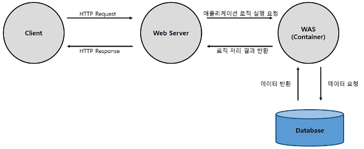

- 1주차 주제: WAS(Web Application Server)
    
    
    1. **미들웨어**
        - 미들(Middle)과 소프트웨어(Software)의 합성어로, 서로 다른 프로토콜이나 시스템 운영체제, 데이터베이스와 애플리케이션 간에 통신을 지원해주는 소프트웨어
        애플리케이션이 어떤 정보시스템 환경에서도 작동할 수 있도록 지원
        - 장점
            - 표준화된 인터페이스를 제공
            - 시스템 간의 데이터 교환에 일관성을 보장
            - 다양한 환경의 지원이 가능하고 체계가 다른 업무와도 상호 연동이 가능
            - 부하의 분산이 가능
            - 위치 투명성 제공(데이터의 위치를 실제 위치를 알지 못해도 접근 가능)
        - 종류
            - RPC(Remote Procedure Call, 원격 프로시저 호출)
                - 응용 프로그램의 프로시저를 사용해 원격 프로시저를 로컬 프로시저처럼 호출하는 방식의 미들웨어
                - Entera(이큐브시스템스), ONC/RPC(ORF)
            - MOM(Message Oriented Middleware, 메시지 지향 미들웨어)
                - 메시지 기반의 비동기형 메시지를 전달하는 방식의 미들웨어
                - 온라인 업무보다 이기종 분산 데이터 시스템의 데이터 동기를 위해 많이 사용
                - 메세지 큐 활용
                - MQ(IBM), Message Q(오라클), JMS(JCP)
            - TP-Monitor(Transection Processing Monitor, 트랜잭션 처리 모니터)
                - 항공기나 철도 예약업무 등과 같은 온라인 트랜잭션을 처리 및 감시하는 미들웨어
                - 사용자 수가 많고 안정적이면서도 즉각적인 처리가 필요할 경우 주로 사용
                - tuxedo(오라클), tmax(티맥스소프트)
            - DB 미들웨어(DataBase Middleware, 데이터베이스 미들웨어)
                - 데이터베이스 벤더에서 제공하는 클라이언트에서 원격의 데이터베이스와 연결하기 위한 미들웨어
                - DB를 사용해 시스템을 구축하는 경우 2-Tier 아키텍처라고 함
                - ODBC(마이크로소프트), IDAPI(볼렌드), Glue(오라클)
            - ORB(Object Request Broker, 객체 요청 브로커)
                - CORBA 표준 스펙을 구현한 객체 지향 미들웨어
                    - CORBA(Common Object Request Broker Architecture, 코바): 네트워크에서 분산 프로그램 객체를 생성, 배포, 관리하기 위한 규격
                - TP-Monitor의 장점인 트랜잭션 처리와 모니터링을 추가한 제품도 나오고 있음
                - Orbix(Micro Focus), CORBA(OMG)
            - 레거시웨어(Legacyware)
                - 기존의 애플리케이션이나 DB 기반에 새로운 업데이트된 기능을 덧붙이고자 할 때 사용되는 미들웨어
            - WAS(Web Application Server)
            
    2. **WAS(Web Application Server)**
        - 서버계층에서 애플리케이션이 동작할 수 있는 환경을 제공하고 안정적인 트랜잭션 처리와 관리, 다른 이기종 시스템과의 애플리케이션 연동을 지원하는 미들웨어
        - DB 조회나 다양한 로직 처리를 요구하는 동적인 콘텐츠를 제공하기 위해 만들어진 서버
        - Web Container로도 불림
        - Web Logic(오라클), WebSphere(IBM), JEUS, Tomcat
        
        
        - Web Server
            - 클라이언트(웹 브라우저 등)로부터 HTTP요청을 받아 정적 콘텐츠(HTML, CSS, IMAGE 등)을 제공
            - 기능
                1. 정적 콘텐츠 제공(WAS를 거치지 않음)
                2. 동적 콘텐츠 제공을 위해 클라이언트의 요청을 WAS에 전달(Request). 
                WAS가 처리한 결과를 클라이언트에게 전달(Response) 
                    - 동적 콘텐츠: 사용자의 요구에 따라 변하는 콘텐츠
                        - 누가, 언제, 어떻게 서버에 요청했는지에 따라 각각 다른 내용이 보여지는 콘텐츠
                        - ex. 쿠팡 메인화면(정적)  /  로그인 후 마이페이지, 장바구니(동적)
                        
            - WAS와 Web Server는 서로 다른 역할을 하지만 WAS는 종종 기본적인 Web Server의 기능을 포함함. 그 반대는 성립하지 않음
                - WAS가 Web Server의 기능도 모두 수행해도 되지 않을까 ?
                    1. 기능을 분리하여 서버 부하 방지
                    2. WAS는 DB에 대한 접속정보가 있기 때문에 외부로 노출될 경우 보안 문제 발생할 수 있음. Web Server에서 SSL에 대한 암복호화 처리
                    3. Web Server에 여러 대의 WAS 연결 가능
                        - 대용량 웹 어플리케이션의 경우 Web Server를 앞 단에 두고 WAS에 오류가 발생하면, Web Server에서 WAS를 사용자가 이용하지 못하게 막아둔 뒤 재시작하여 사용자가 오류를 느끼지 못하게 할 수 있음.
                        - load balancing: 서버에 가해지는 부하를 분산
            - 웹 서비스 아키텍처
                - Client -> Web Server -> DB
                - Client -> WAS -> DB
                - Client -> Web Server -> WAS -> DB
                - Client -> Web Server -> 여러 개의 WAS -> DB
                
            
            **웹 서버를 WAS 앞에 두고, 필요한 WAS들을 웹 서버에 플러그인 형태로 설정하면 
            효율적인 분산 처리가 가능하다.**